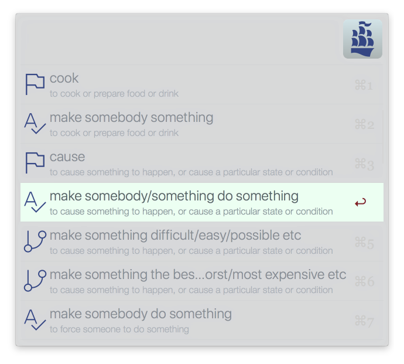
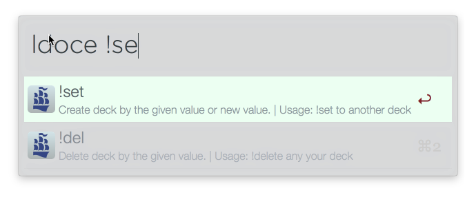
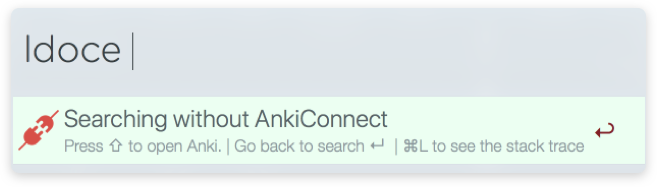
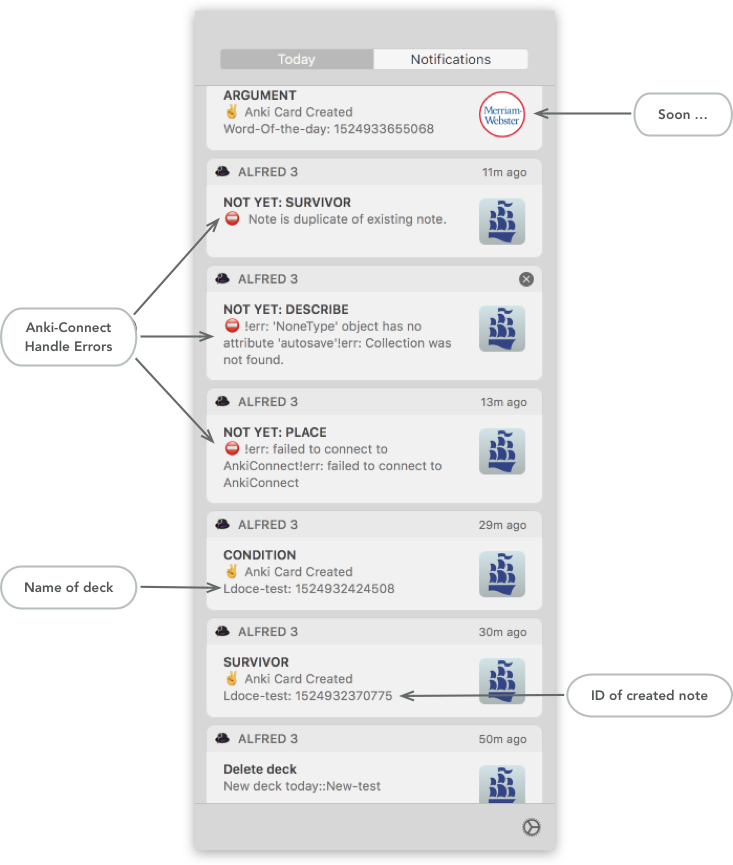

# alfred-ldoce-express [](https://travis-ci.org/bikenik/alfred-ldoce)

> [Alfred 3](https://www.alfredapp.com) workflow to quick look of Longman dictionary and creating [Anki](https://apps.ankiweb.net) cards.

#### Search by headword or across all entries


#### Create, choose and delete your decks in Anki


#### Use <kbd>⌘L</kbd> for more info by large text and copy it
>![Use [⌘L] for more info by large text and copy it](./media-readme/largeText.png)

#### Warnings, Notifications
>  

>  

#### Try [this](https://github.com/bikenik/alfred-ldoce/blob/master/Ldoce-Express.apkg) Anki theme (Scramble-sentences) to learning by created cards

## Description

The search, `ldoce <query>`, uses [Pearson's API](http://developer.pearson.com/apis/dictionaries) to hunt for headwords and senses that match `headeword/<query>`. 25 results are retrieved by default for headword search.
This workflow searches from Longman Dictionary of Contemporary English (5th edition)[ldoce5 - API]. And creates Anki cards by your choices (if an article of the current word in this API not existing audio examples the Alfred will create audio examples from [Oddcast](http://www.oddcast.com/demos/tts/tts_example.php?clients). [uses random voices: Julie, Kate, James]

## Install

```
$ npm install --global alfred-ldoce
```

* Download and import the [deck example](https://github.com/bikenik/alfred-ldoce/blob/master/Ldoce-Express.apkg) for Anki to install template for this grabbing from ldoce Api.

_Requires: [Node.js](https://nodejs.org) 7.6+, Alfred [Powerpack](https://www.alfredapp.com/powerpack/), [Anki](https://apps.ankiweb.net) intelligent flash cards, [AnkiConnect](https://ankiweb.net/shared/info/2055492159) plugin for Anki._

## Usage
[video presentation](https://youtu.be/MD6wpJJIzHc)

##### In Alfred, type <kbd>ldoce</kbd>, <kbd>Enter</kbd>, and your query.

* <kbd>`ldoce <query>`</kbd>
  — Search for entries with the given headword 
* <kbd>`ldoces <query>`</kbd>
  — Generic text search across all entries (searchs all entry fields)
  - <kbd>⇥</kbd>, <kbd>↩</kbd> or <kbd>⌘ + NUM</kbd>
  — Show senses of selected headword 
  - <kbd>⌥ + ↩</kbd> — Show phrasal verbs for selected headword if exist (for verbs only). 
  - <kbd>⇧</kbd> or <kbd>⌘ + L</kbd>
  — Show Quick Look preview from [ldoceonline.com/dictionary/query](https://www.ldoceonline.com)

* <kbd>`<query>`</kbd> — Search for previous matching        <kbd>ldoce <query></kbd>

  * <kbd>⇥</kbd>, <kbd>↩</kbd> or <kbd>⌘ + NUM</kbd> or click — select to choose sense for creating card
  * <kbd>⌘ + L</kbd> — Show one of vocabulary entries in Alfred's "Large Type" window
  * <kbd>⌘ + ↩</kbd> — create card from selected senses of word
  * <kbd>⌥ + ↩</kbd> — create card from all matching of current query
  * <kbd>fn + ↩</kbd> — export current vocabulary entries to other workfows "Call External"
* <kbd>`<ldl>`</kbd> or <kbd>`<ldp>`</kbd> (last query or last query for phrasal verb) go to the definition of the word of the last query
* If you notice this sign 🔦 it means the current deffinition exist additional words for search. Hit <kbd>⌃ + ↵</kbd> (SEE ALSO) to show and search by this words.
* <kbd><!set></kbd> or <kbd><!del></kbd> — Choose, create or delete deck for Anki


**Note:** OS X's "delete word" shortcut ( <kbd>⌥ + ⌫</kbd> ) is very handy for backing out of a current search result.

## notation conventions


: Regular


: Gramatical


: Phrasal verbs


: Collocation


: Run-on sentences

## Configuration

* There is three options: 
	- `language`: [Choose your language](https://cloud.google.com/translate/docs/languages) (it use google-translate-api).
	- `path_to_anki-media`: by default don't need to change.
  - `note_type`: "Ldoce-Express" - by default don't need to change.

### ToDo

- [x] Update Readme
- [ ] Add Frequency by "Ldoce 9000"
- [ ] Add more info (like "due", "new" and count of cards) through the AnkiConnect
- [ ] Tests

## License

MIT © [bikeNik](https://github.com/bikenik)
